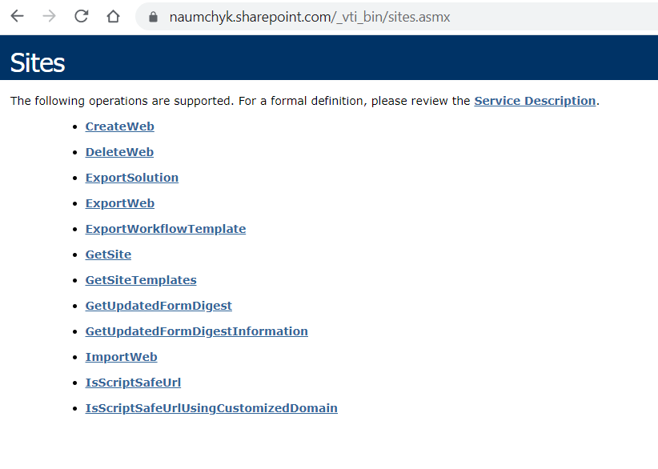

# SP DEV + SPFx

Ein Kurs von PPEDV :rocket:

Datum: 14. - 16.06.2021, 15. - 16.07.2021

Ort: VC

Format: Vollzeit

[Agenda von diesem Kurs auf ppedv.de](https://ppedv.de/schulung/kurse/SharePointEntwicklungProgrammierungWorkflowWebPartBCSSeminarTrainingPowerwoche.aspx)

*oder verlinke zum Kursblatt auf ppedv.de Seite im Abschnitt `About` oben rechts neben dem grünen Button `Code`.*

## WARMING UP

- [ ] Folien: Greeter.pdf
  
## VS TEMPLATES FOR SP

- [ ] Commit [zwei templates in vs](https://github.com/ppedvAG/2021-06-14-SPdev-SPFx/commit/0d4047a74742ada2d50d6b5191725020195d7ff3)
- [ ] Demos
  - [ ] [Template von Visual WebPart 1](TRAINER/SPVisualWebPart1_VN/SPVisualWebPart1_VN)
  - [ ] [Template von Empty Sandboxed Solution](TRAINER/SP_Leer_Sandboxed/SP_Leer_Sandboxed)

## SPFX

- [ ] Commits
  - [ ] [spfx first webpart](https://github.com/ppedvAG/2021-06-14-SPdev-SPFx/commit/f52b21417b44d45b0a95231c4d03cc9db6069be9)
  - [ ] [first web part and proppane done](https://github.com/ppedvAG/2021-06-14-SPdev-SPFx/commit/78e3fc5fd53cb54c2a0c454f8fbf2467dd0574b6)
- [ ] Demos
  - [ ] [FirstVNwpWebPart.ts](TRAINER/firstVN/src/webparts/firstVNwp/FirstVNwpWebPart.ts)

## TYPESCRIPT

- [ ] Commit [typescript wp](https://github.com/ppedvAG/2021-06-14-SPdev-SPFx/commit/01280ca0ccc153d1798761e3e72024ae2c21833f)
  - [ ] Demos
    - [ ] [TypeScriptVnWebPart.ts](TRAINER/firstVN/src/webparts/typeScriptVn/TypeScriptVnWebPart.ts)
    - [ ] [fetchTodos.html](TRAINER/firstVN/src/webparts/typeScriptVn/fetchTodos.html)

## CONTEXT, SP HTTP CLIENT

- [ ] Commits
  - [ ] [sphttpclient sp data](https://github.com/ppedvAG/2021-06-14-SPdev-SPFx/commit/9352ba02895a1ff16bbac1b92f9fefc77034481d)
  - [ ] [sphttpclient lists done](https://github.com/ppedvAG/2021-06-14-SPdev-SPFx/commit/02a203b64cbe54e21df4bbeb30f5dfdcae6c956e)
- [ ] Demos
  - [ ] [ContextVnWebPart.ts](TRAINER/firstVN/src/webparts/contextVn/ContextVnWebPart.ts)
  - [ ] [SpHttpClientVnWebPart.ts](TRAINER/firstVN/src/webparts/spHttpClientVn/SpHttpClientVnWebPart.ts)

## REACT

- [ ] Commit [react input from proppane](https://github.com/ppedvAG/2021-06-14-SPdev-SPFx/commit/34e8ad99c34811e97f5676a6b44686d278ae9497)
- [ ] Demos
  - [ ] [ReactWpVnWebPart.ts](TRAINER/firstVN/src/webparts/reactWpVn/ReactWpVnWebPart.ts)
  - [ ] [ReactWpVn.tsx](TRAINER/firstVN/src/webparts/reactWpVn/components/ReactWpVn.tsx)

## REACT COMPONENTS

- [ ] Commits
  - [ ] [react list termine durch zwei komponenten](https://github.com/ppedvAG/2021-06-14-SPdev-SPFx/commit/48bc8eeb5b6265b86b1d9c72093dc56773a5f351)
  - [ ] [termineWP mit Kommentaren](https://github.com/ppedvAG/2021-06-14-SPdev-SPFx/commit/9c9df182950571e654061c033ca82e1159e952b3)
- [ ] Demos
  - [ ] [emmet.html](TRAINER/emmet.html)
  - [ ] [TermineVnWebPart.ts](TRAINER/firstVN/src/webparts/termineVn/TermineVnWebPart.ts)
  - [ ] [Termin.tsx](TRAINER/firstVN/src/webparts/termineVn/components/Termin.tsx)
  - [ ] [TermineVn.tsx](TRAINER/firstVN/src/webparts/termineVn/components/TermineVn.tsx)

## MS GRAPH, APP CUSTOMIZER, MS CSS

- [ ] Commits
  - [ ] [ms graph versuch](https://github.com/ppedvAG/2021-06-14-SPdev-SPFx/commit/b844d0df9c385e0b34ad86b1cff1f2a04dceed4d)
  - [ ] [graph consumer](https://github.com/ppedvAG/2021-06-14-SPdev-SPFx/commit/1759e9ec7f94da3e59381ddf8e773ad652ab10c0)
  - [ ] [graph consumer tlnm](https://github.com/ppedvAG/2021-06-14-SPdev-SPFx/commit/0c239df162e74c72f70c00ab8a2ce4f568e23573)
- [ ] Demos
  - [ ] [GraphConsumerWebPart.ts](TRAINER/firstVN/src/webparts/graphConsumer/GraphConsumerWebPart.ts)
  - [ ] [GraphConsumer.tsx](TRAINER/firstVN/src/webparts/graphConsumer/components/GraphConsumer.tsx)
  - [ ] [GraphConsumerKbWebPart.ts](TRAINER/GraphConsumer/src/webparts/graphConsumerKb/GraphConsumerKbWebPart.ts)
  - [ ] [GraphConsumerKb.tsx](TRAINER/GraphConsumer/src/webparts/graphConsumerKb/components/GraphConsumerKb.tsx)
  - [ ] [AppCsmzVnApplicationCustomizer.ts](TRAINER/ExtensionsVN/src/extensions/appCstmzVn/AppCstmzVnApplicationCustomizer.ts)
  - [ ] [MsCssWebPart.ts](TRAINER/firstVN/src/webparts/msCss/MsCssWebPart.ts)

## add-ins

## asp.net web forms

- web forms controls
- sind gut für provider-hosted SP Add-Ins

## taxonomie context (Marko)

## c sharp

## bestehende Seiten und Intranet anpassen

- Layout von Objekten
- Masterpage. Folie: ### MASTERPAGE
  - siehe auch ASP.NET Web Forms Kurs bei PPEDV > MasterPages erstellen

## site templates

[https://naumchyk.sharepoint.com/_vti_bin/sites.asmx]

## ausblick powerapps und flow
